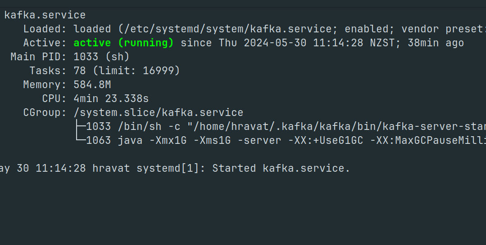
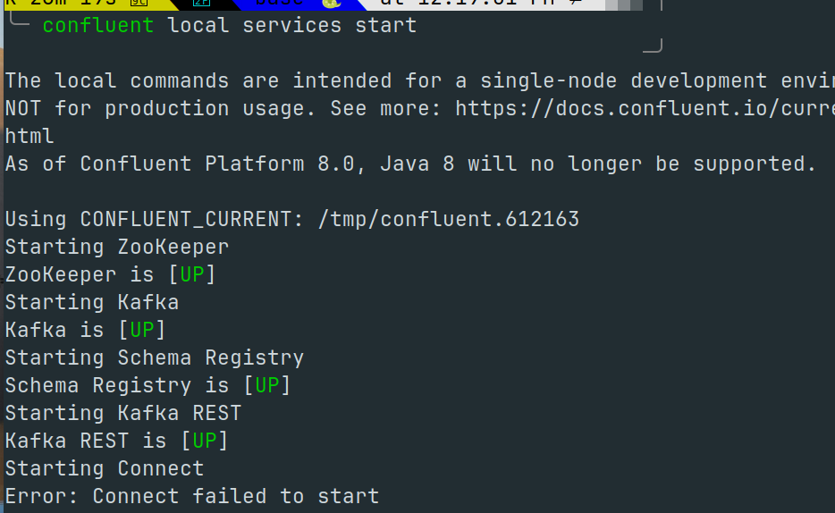
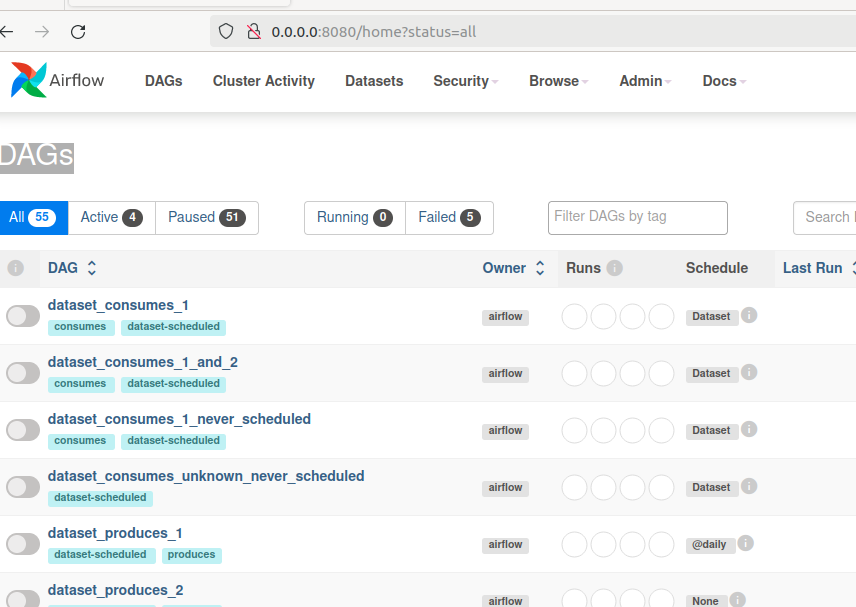
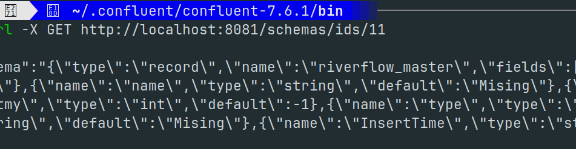
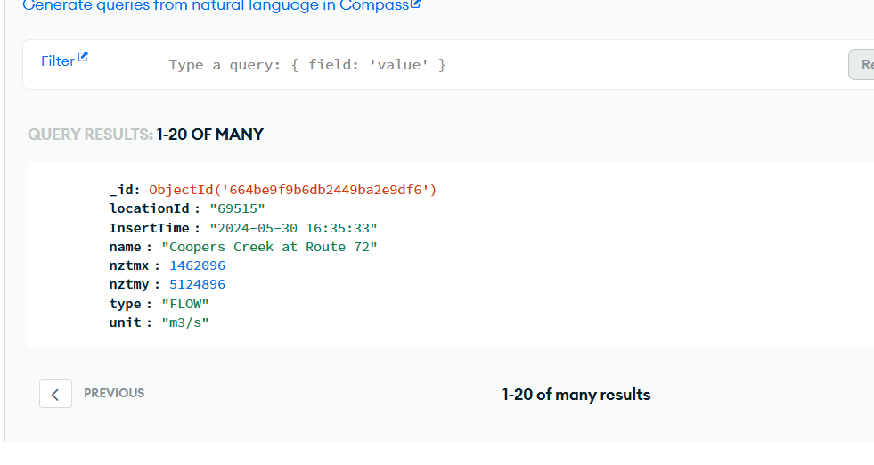
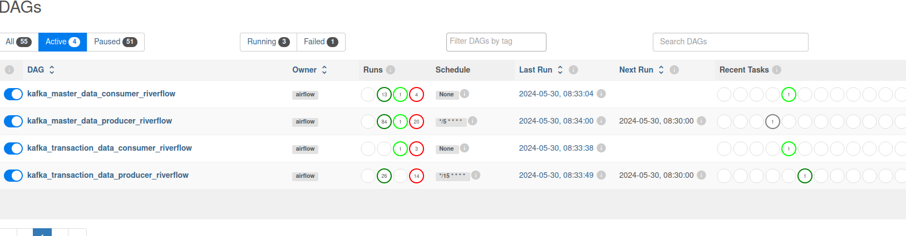
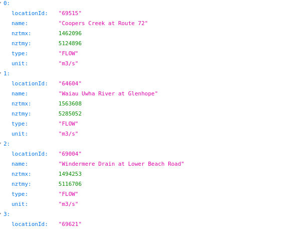
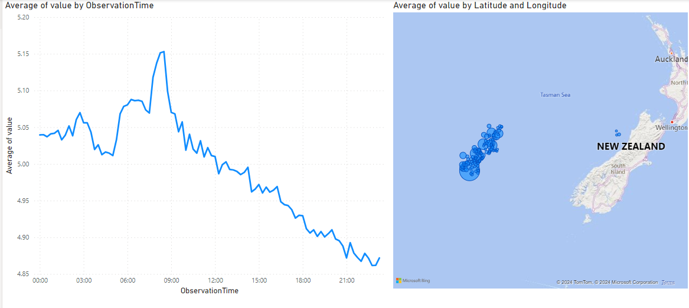

This repository contains steps to set up a data pipeline from the ECANS riverflow dataset to mongodb atlas which is a cloud based mongodb service. This databasse can then be queried using get  requests to a flaskapp running on an AWS EC2 instance. 

##  The major components in the pipeline are as follows : - 

1) The ECANS Riiverflow dataset which exposes an api (GraphQL) to extract data 
2) Kafka used to store and distribute messages recieved from the API 
3) Confluent Kafka for schema registry and maintainence
4) Apache Airflow with Postgres for scheduling 
5) Mongodb atlas as a cloud datastore
6) Flask app used to serve get requests for getting the data from MongoDB
7) AWS EC2 instance to host the flask app 
8) Power BI which connects to Mongo DB for Data Visualization.  

## Please note 

PLEASE NOTE THAT IN THIS PROJECT A MAJOR EFFORT WAS SPENT IN INSTALLING IN SETTING UP SERVICES AS COMPARED 
TO WRITING THE ACTUAL CODE. 

## Installation of Kafka 

PLease follow innnnnnstructions in the below link to install kafka 
[Installation of Kafka ]{https://www.digitalocean.com/community/tutorials/how-to-install-apache-kafka-on-ubuntu-20-04}

The only differncemade by me was not adding a seperate user to avoid switching users in linux 

``` sudo systemctl start kafka ``` 

Confirm if Kafka services are running 

``` sudo systemctl status kafka ``` 



## Installation of Confluent Kafka 

PLease refer the bleow video to install confluent kafka 
![Confluent Kafka]{https://www.youtube.com/watch?v=df5NKCa-s6g}


Confirm that confluent Kafka is running by starting the service 

``` confluent local services start ```



## Installation of Apache Airflow with Postgres 
(Please do not use SQLITE with apache airflow)

[Apache Airflow with Postgres]{https://medium.com/geekculture/apache-airflow-2-0-complete-installation-with-wsl-explained-71a65d509aba}

We  assume that you are running a linux environment and have anaconda or minconda installed 
It is advisable to use anaconda but python also will suffice

We then need to follow the instructions in the above link to install apache airflow with postgres .  
The only difference is you need to create and activate a conda environment for Apache Airflow and then run  

``` pip install apache-airflow['postgresql'] ```


To start the airflow services run the below commands after actinvating the conda environment 

``` airflow webserver ```

``` airflow scheduler ```

Confirm if airflow is running 




## Project Specific Setups 

### Installing Required Packages 

Create a seperate environment conda environment for running tis pipeline 
Once the environmnet is activated run 

``` pip install -r conda-requirements.txt ``` 

### ECAN Website Subscription 

Please head over to the [ECAN website]{https://apidevelopers.ecan.govt.nz/} and create an account for url subscription

Set the Environment varialbe ``` ECAN_SUBSCRIPTION_KEY ```  to the subscription key you recive afer sign up 

### Registing for Mongo DB Atlas 

PLeasee head [Mongo DB Atlas]{https://cloud.mongodb.com/} for a mongo DB Account 

Create a database ``` de-river-flow ```

Create two documents ``` river-flow-master-data ``` and ```  river-flow-transaction-data ```

Set  the Environment Variable ``` MONGODB_ATLAS_URL ``` to the URL of the MongoDB Cluster 

To get the URL please go to Connect in MongoDB Atlas and Click on Shell


### Starting Kafka and Confluent Kafka  
(PLEASE NOTE SETTING THIS PART IS A BIT TRICKY INVOVLVING SOME CODE CHANGES.
I HAVE NOTE BEEN ABLE TO COME UP WITH A CLEAN WAY TO SET THIS UP)

Please start kafka and Confluent Kafka 

Set the Environment variable ``` DE_ECAN_QUERY_PATH ``` to the path api-queries

Create the kafka topics using the blow commands after naving ating to the confluent bin directory :- 

``` confluent kafka topic create river-flow-master-data --partitions 3 --replication-factor 1 ```

``` confluent kafka topic create river-flow-transaction-data --partitions 3 --replication-factor 1 ```

Check if the topics are created : - 

``` kafka-topics --bootstrap-server localhost:9092 --list ```

The first time the code is run the necessary schema will created from the schema files in 
the mongodb-schema  

For this uncomment lines under the comment ``` # Configure AvroProducer for first run ```
and run the python file. 

``` 
with open("mongodb-schemas/riverflow_master.avsc") as f:
    value_schema = f.read()

```

Once this is done navigate to confluent bin directory to get the schema ID's and add the schema id in the line below the comments `` # Configure AvroProducer for first run ``` 

You will need to enter a number for the schema id manually till you find the mathcing schema 

``` curl -X GET http://localhost:8081/schemas/ids/11  ```

```
schema_id='11'

```



Please comment both the lines where the files are being read.

### Testing the set up 

We will first start the consumers 

``` python AvroRiverFlowMasterDataConsumer.py ```

``` python AvroRiverFlowTransactionDataConsumer.py  ```

We will then start the data producers 

``` python AvroRiverFlowMasterDataProducer.py ```

``` python AvroRiverFlowTransactionDataProducer.py  ```

Then check if you are able to view data in mongodb




### Scheduling the scripts in airflow 

Copy the files in airflow-dags folder to the airflow dags path  : - 

``` ~/airflow/dags ```

Set  the Environment Variable ``` DE_CONDA_ENV ``` to the path of the Data Engineering Conda Env 

Set  the Environment Variable ``` DE_KAFKA_FILE_PATH ``` where the consumer and producer scripts for python are set 


Activate the conda environment start airflow services with the below commands and log into airflow 

``` airflow webserver ```

``` airflow scheduler ``` 

[Airflow Web UI]{http://localhost:8080}

Activiate the DAG'S and check for succesful run 




If any changed are made to the DAG files run below command 

``` airflow dags reseraialize ```


### This completes the data flow . We will now look at deploying Flask App and visualizing data in Power BI

### Setting up Flask app for get requests 

THe flask appp set up is done on an EC2 instance.
It is assumed you have an EC2 instance running on AWS.
However you can also do the set up on a Local Machine.

Log into your EC2 instance and create a conda environment .  

Run the below commands to install the necessary packages 

``` conda install anaconda::flask ``` 

```  conda install conda-forge::flask-pymongo ``` 

Run below command to start the Flask appp 

``` python main.py ```


The data can the be got with the below requets 


1) ``` http://<EC2-PUBLIC-IP>:5000///get-document/river-flow-master-data-by-location?locationId=<location-id> ```
2) ``` http://<EC2-PUBLIC-IP>:5000/get-document/river-flow-transaction-data-location?locationId=<location-id>start_date=<YYYY-MM-DD%20HH:MI:SS>&end_date=<YYYY-MM-DD%20HH:MI:SS> ```
3) ``` http://<EC2-PUBLIC-IP>:5000///get-document/river-flow-all-master-data ```
4) ``` http://<EC2-PUBLIC-IP>:5000/get-document/river-flow-transaction-data-all?start_date=<YYYY-MM-DD%20HH:MI:SS>&end_date=<YYYY-MM-DD%20HH:MI:SS> ```



### Connecting to Power BI

![Connect Power BI to Mongo DB]{https://www.mongodb.com/docs/bi-connector/current/connect/powerbi/}

Once this is done you can create any visualization 





